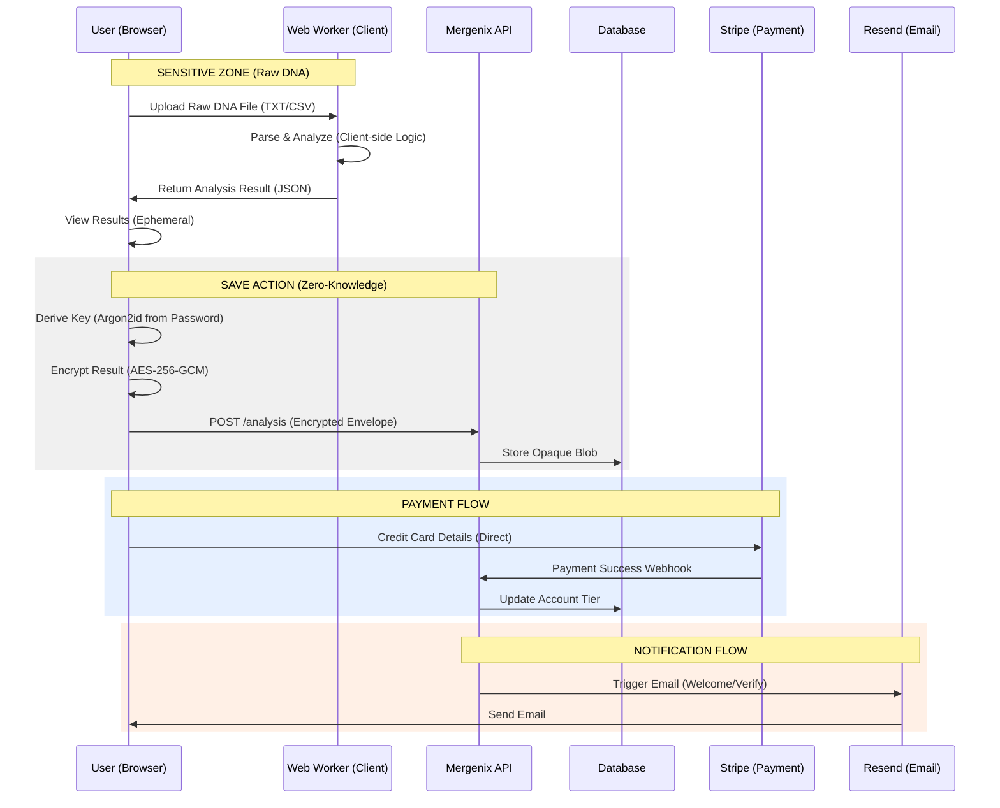

# Data Protection Impact Assessment (DPIA)

**Project Name:** Mergenix (Genetic Offspring Analysis Platform)  
**Controller:** Mergenix  
**Version:** 1.0  
**Date:** 2026-02-20  
**Status:** Draft / Pre-Launch Review  
**Reference:** GDPR Article 35

---

## 1. Executive Summary

Mergenix is a direct-to-consumer genetic analysis platform allowing users to compare genetic data (e.g., from 23andMe, AncestryDNA) to predict offspring traits and disease risks.

This DPIA is triggered under **GDPR Article 35(3)(b)** because the processing involves "processing on a large scale of special categories of data" (genetic data regarding health).

**Key Privacy Architecture:** Mergenix utilizes a **Zero-Knowledge / Client-Side** architecture. Raw genetic data is processed exclusively within the user's browser (Web Workers) and is **never** transmitted to Mergenix servers. Only the _results_ of the analysis are transmitted, and these are encrypted client-side using a key derived from the user's password (AES-256-GCM). Mergenix possesses no technical means to decrypt user data ("opaque encrypted envelopes").

---

## 2. Systematic Description of Processing (Article 35(7)(a))

### 2.1 Nature, Scope, Context, and Purpose

- **Nature:** Processing of raw genetic data files (txt/csv) to identify Single Nucleotide Polymorphisms (SNPs). Calculation of carrier status for 2,697 diseases, 79 trait predictions, pharmacogenomics for 12 genes, and polygenic risk scores.
- **Scope:** Global user base, including data subjects within the EEA. Data includes Genetic Data (Article 9) and Personal Data (Article 4).
- **Context:** Users voluntarily upload data for educational and informational purposes. The service is not a medical device.
- **Purpose:** To provide users with probabilistic estimates of hereditary risks and traits for hypothetical offspring, facilitating informed family planning discussions (educational only) and lifestyle optimization.

### 2.2 Data Flow Diagram

### 2.3 Asset Inventory & Data Types

| Data Category      | Examples                            | Storage Location        | Retention                                                         |
| :----------------- | :---------------------------------- | :---------------------- | :---------------------------------------------------------------- |
| **Genetic Data**   | Raw DNA files (23andMe, etc.)       | **Browser Memory Only** | Ephemeral (Session only)                                          |
| **Health Data**    | Disease carrier status, risk scores | **Encrypted Database**  | Until user deletion                                               |
| **Account Data**   | Email, Password Hash (Bcrypt)       | Database                | Life of account + 30 days                                         |
| **Financial Data** | Payment tokens, transaction history | Stripe (Sub-processor)  | 7 Years (Tax law)                                                 |
| **Tech Data**      | IP Address, User Agent              | Audit Logs              | 90 days (orphaned) / 1 year (general) / 2 years (security events) |

---

## 3. Assessment of Necessity and Proportionality (Article 35(7)(b))

### 3.1 Lawful Basis

- **Genetic Analysis:** **Article 9(2)(a) - Explicit Consent.** The user must affirmatively agree to a dedicated consent modal explaining the processing of special category data before analysis begins.
- **Account Management:** **Article 6(1)(b) - Contract.** Necessary to provide the service (save results, manage tiers).
- **Payments:** **Article 6(1)(c) - Legal Obligation** (tax reporting) and **Article 6(1)(b)**.

### 3.2 Minimization Analysis

The architecture strictly adheres to **Data Minimization (Article 5(1)(c))**:

- **Raw Data:** Never collected. Processing moves to the data, rather than data moving to the processor.
- **Results:** Only stored if explicitly saved by the user. Stored in an encrypted state where the controller (Mergenix) has no access.
- **Identifiability:** User accounts are pseudonymized vis-a-vis the genetic data due to the encryption barrier.

---

## 4. Assessment of Risks (Article 35(7)(c))

We have assessed risks to the rights and freedoms of data subjects using a standard Risk Matrix (Likelihood × Severity).

| ID     | Risk Description                                                                                               | Pre-Mitigation Level | Mitigation Measures                                                                                                                                                     | Residual Risk |
| :----- | :------------------------------------------------------------------------------------------------------------- | :------------------- | :---------------------------------------------------------------------------------------------------------------------------------------------------------------------- | :------------ |
| **R1** | **Server Data Breach:** Attacker gains SQL access to Mergenix database, stealing genetic analysis records.     | **High**             | **Zero-Knowledge Encryption:** Data is encrypted client-side. Server breach yields only opaque blobs without the decryption keys (which reside in user heads/browsers). | **Low**       |
| **R2** | **Unauthorized Access:** Rogue employee accesses user health data.                                             | **Medium**           | **Technical Infeasibility:** Employees cannot decrypt user data. Strict RBAC for metadata access.                                                                       | **Low**       |
| **R3** | **Genetic Discrimination:** Data leaked to insurers/employers leading to discrimination (GINA/GDPR violation). | **High**             | **Architecture & Policy:** No raw data stored. Encrypted results. Strict "No Sell" policy. Disclaimer that results are not clinical.                                    | **Low**       |
| **R4** | **Loss of Availability:** User forgets password and loses access to genetic history.                           | **Medium**           | **Acceptable Trade-off:** Due to ZKE, password loss = data loss. We provide clear warnings. We prioritize confidentiality over availability for this specific dataset.  | **Medium**    |
| **R5** | **Inaccurate Results:** User relies on probabilistic data for medical decisions (e.g., terminating pregnancy). | **High**             | **Disclaimers & UX:** clear "Not Medical Advice" labels. Recommendation to consult genetic counselors. Results presented as "Risk Odds" not diagnostic certainties.     | **Medium**    |
| **R6** | **Sub-processor Breach:** Stripe or Resend compromised.                                                        | **Low**              | **Vendor Vetting:** Use of Tier-1 providers with ISO 27001/SOC2 certifications. No genetic data shared with these providers.                                            | **Low**       |

---

## 5. Measures to Address Risks (Article 35(7)(d))

### 5.1 Technical Measures

1.  **Client-Side Processing:** Use of HTML5 Web Workers to process multi-megabyte genomic files within the DOM, preventing network transmission.
2.  **Encryption:**
    - **At Rest:** AES-256-GCM for user data blobs.
    - **In Transit:** TLS 1.3 for all communications.
    - **Password Hashing (Server-Side):** Bcrypt via passlib — server-stored password hashes use bcrypt.
    - **Key Derivation (Client-Side ZKE):** Argon2id — used in the browser to derive the AES-256-GCM encryption key from the user's password before encrypting the analysis result. The server never sees this key or the plaintext.
3.  **Access Control:** strict IAM policies for cloud infrastructure (Railway/Vercel).

### 5.2 Organizational Measures

1.  **Staff Training:** Mandatory GDPR and HIPAA-awareness training for all engineers.
2.  **Data Retention Policy:** Automated cron jobs to purge inactive free-tier accounts (3 years inactivity), security audit logs (2 years / 730 days), general audit logs (1 year / 365 days), and orphaned audit records (90 days).
3.  **Incident Response Plan:** Defined procedures for breach notification (72-hour window for GDPR).

### 5.3 Legal Measures

1.  **Terms of Service:** Explicit prohibition of using the tool for clinical diagnosis.
2.  **Sub-processor Agreements:** Data Processing Addendums (DPAs) signed with Stripe and Resend.
3.  **EU Representative:** (Evaluation: **Required**). Mergenix is based outside the EU but targets EU citizens. We will appoint an Article 27 representative prior to GA launch.

---

## 6. Sub-processors

| Provider         | Purpose                | Location   | Legal Basis for Transfer              |
| :--------------- | :--------------------- | :--------- | :------------------------------------ |
| **Stripe, Inc.** | Payment Processing     | USA        | EU-U.S. Data Privacy Framework / SCCs |
| **Resend**       | Transactional Email    | USA        | SCCs (Standard Contractual Clauses)   |
| **Vercel**       | Hosting & Edge Network | Global/USA | SCCs                                  |
| **Railway**      | Database Hosting       | USA        | SCCs                                  |

---

## 7. Consultation & Sign-off

**Data Protection Officer (DPO) Opinion:**

_Note: This section is a pro forma template. It will be formally signed by the appointed DPO prior to GA launch (see docs/legal/dpo-appointment.md)._

The architecture represents a "Privacy by Design" approach. The primary residual risk is user behavior (weak passwords leading to individual account compromise), which is mitigated by enforcement of password complexity. The trade-off regarding data recovery (password loss = data loss) is acceptable and necessary to maintain the Zero-Knowledge claim.

**Review Schedule:**
This DPIA will be reviewed:

1.  Prior to General Availability (GA) launch.
2.  Upon any major architectural change (e.g., moving analysis to server-side).
3.  Annually.

**Signed:**

---

_Chief Technology Officer_  
Date: 2026-02-20

---

_Legal Counsel / Privacy Team_  
Date: 2026-02-20
