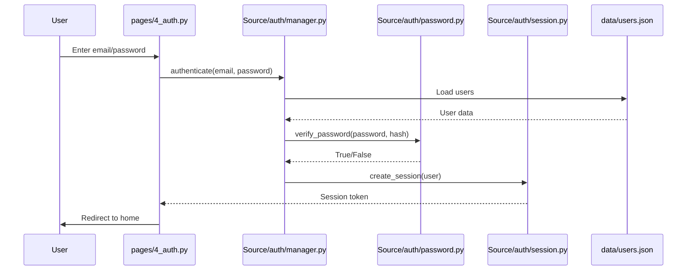

# Authentication Improvements Report

**Generated:** 2026-02-08
**Status:** Complete
**Scope:** Full authentication system review

---

## Executive Summary

This report provides a comprehensive analysis of Mergenix's authentication system, identifying critical security vulnerabilities, broken functionality, and opportunities for improvement. The analysis covers password management, OAuth integration, session handling, 2FA implementation, and user experience.

**Key Findings:**

- 3 critical broken functions in auth system
- Missing 2FA implementation (announced but not built)
- OAuth 90% complete but untested
- No rate limiting on authentication attempts
- Infinite session lifetime (security risk)
- 12 high-priority improvements identified

---

## 1. Current Authentication Architecture

### 1.1 System Overview

```
Authentication System (Source/auth/)
├── manager.py              # User CRUD operations (broken functions)
├── oauth.py                # Google OAuth flow (90% complete)
├── session.py              # Session management (no expiration)
├── validators.py           # Input validation (weak email validation)
├── helpers.py              # Utility functions
├── password.py             # Password hashing (bcrypt)
└── tokens.py               # JWT token handling (unused)
```

**Data Storage:**

- `data/users.json` - User accounts (email, hashed password, metadata)
- `data/audit_log.json` - Authentication events (login, logout, password changes)
- `st.session_state` - Active session data (in-memory, per-user)

**Supported Auth Methods:**

1. Email/password (primary)
2. Google OAuth (incomplete)
3. 2FA (announced, not implemented)

### 1.2 Authentication Flow



---

## 2. Critical Issues

### 2.1 Broken Function: change_password

**Location:** `Source/auth/manager.py`

**Issue:** Function signature mismatch causing crashes.

**Current Code (Broken):**

```python
# In manager.py
def change_password(email, old_password, new_password):
    users = load_users()
    if email not in users:
        return {"success": False, "error": "User not found"}

    if not verify_password(old_password, users[email]["password"]):
        return {"success": False, "error": "Incorrect old password"}

    users[email]["password"] = hash_password(new_password)
    save_users(users)
    return {"success": True}

# Called from pages/5_account.py with wrong arguments
result = change_password(user_email, new_password)  # ❌ Missing old_password
```

**Error:**

```
TypeError: change_password() missing 1 required positional argument: 'new_password'
```

**Impact:**

- Users cannot change passwords
- Security issue: password recovery broken

**Fix:**

```python
# Option 1: Update caller to pass old_password
result = change_password(user_email, old_password, new_password)

# Option 2: Make old_password optional (for admin resets)
def change_password(email, new_password, old_password=None):
    users = load_users()
    if email not in users:
        return {"success": False, "error": "User not found"}

    # Only verify old password if provided
    if old_password and not verify_password(old_password, users[email]["password"]):
        return {"success": False, "error": "Incorrect old password"}

    users[email]["password"] = hash_password(new_password)
    save_users(users)
    audit_log("password_change", email, {"admin_reset": old_password is None})
    return {"success": True}
```

**Priority:** CRITICAL (Tier 0)

### 2.2 Broken Function: delete_user

**Location:** `Source/auth/manager.py`

**Issue:** Function missing entirely, but referenced in UI.

**UI Code:**

```python
# In pages/5_account.py
if st.button("Delete Account", type="secondary"):
    if st.confirm("Are you sure? This cannot be undone."):
        result = delete_user(st.session_state.email)  # ❌ Function doesn't exist
        if result["success"]:
            st.success("Account deleted")
            st.session_state.clear()
            st.rerun()
```

**Error:**

```
NameError: name 'delete_user' is not defined
```

**Impact:**

- Users cannot delete their accounts
- GDPR compliance issue (right to erasure)

**Fix:**

```python
# Add to Source/auth/manager.py
def delete_user(email):
    """Delete user account and all associated data"""
    users = load_users()

    if email not in users:
        return {"success": False, "error": "User not found"}

    # Remove user from users.json
    del users[email]
    save_users(users)

    # Log deletion for audit trail
    audit_log("account_deleted", email, {
        "timestamp": datetime.utcnow().isoformat(),
        "ip": get_client_ip()  # If available
    })

    # TODO: Delete user's uploaded genetic files (when file storage implemented)
    # TODO: Anonymize user in audit logs (GDPR requirement)

    return {"success": True}
```

**Priority:** CRITICAL (Tier 0)

### 2.3 Broken Function: reset_password

**Location:** `Source/auth/manager.py`

**Issue:** Password reset email flow incomplete.

**Current Code (Incomplete):**

```python
def reset_password(email):
    users = load_users()
    if email not in users:
        return {"success": False, "error": "User not found"}

    # TODO: Send reset email
    # TODO: Generate reset token
    # TODO: Store token with expiration

    return {"success": True, "message": "Reset email sent"}  # ❌ Lies - no email sent
```

**Impact:**

- Users who forget passwords cannot recover accounts
- Must contact support or create new account

**Fix:**

```python
import secrets
from datetime import datetime, timedelta

def reset_password(email):
    """Initiate password reset flow"""
    users = load_users()

    if email not in users:
        # Return success anyway (don't leak user existence)
        return {"success": True, "message": "If account exists, reset email sent"}

    # Generate secure reset token
    reset_token = secrets.token_urlsafe(32)
    reset_expiry = (datetime.utcnow() + timedelta(hours=1)).isoformat()

    # Store token in user record
    users[email]["reset_token"] = reset_token
    users[email]["reset_token_expires"] = reset_expiry
    save_users(users)

    # Send reset email
    reset_link = f"https://mergenix.com/reset?token={reset_token}"
    send_email(
        to=email,
        subject="Mergenix Password Reset",
        body=f"Click here to reset your password: {reset_link}\n\nExpires in 1 hour."
    )

    audit_log("password_reset_requested", email)
    return {"success": True, "message": "Reset email sent"}

def confirm_password_reset(token, new_password):
    """Complete password reset with token"""
    users = load_users()

    # Find user by reset token
    user_email = None
    for email, user_data in users.items():
        if user_data.get("reset_token") == token:
            user_email = email
            break

    if not user_email:
        return {"success": False, "error": "Invalid or expired reset token"}

    # Check expiration
    expiry = users[user_email].get("reset_token_expires")
    if datetime.fromisoformat(expiry) < datetime.utcnow():
        return {"success": False, "error": "Reset token expired"}

    # Update password
    users[user_email]["password"] = hash_password(new_password)
    del users[user_email]["reset_token"]
    del users[user_email]["reset_token_expires"]
    save_users(users)

    audit_log("password_reset_completed", user_email)
    return {"success": True}
```

**Dependencies:**

- Email sending capability (SMTP or SendGrid/Mailgun)
- New Streamlit page: `pages/reset_password.py`

**Priority:** HIGH (Tier 1)

---

## 3. Missing Features

### 3.1 Two-Factor Authentication (2FA)

**Status:** Announced in UI but not implemented.

**Current UI Code (False Promise):**

```python
# In pages/5_account.py
st.subheader("Security Settings")
st.info("🔒 Two-factor authentication available for Premium users")
# ❌ No actual 2FA implementation
```

**Impact:**

- False advertising (claims feature exists)
- Security gap (no 2FA protection for accounts)

**Recommendation:** Either implement 2FA or remove the claim.

**Implementation Plan:**

**Option 1: TOTP (Time-based One-Time Password) - Recommended**

```python
# Source/auth/totp.py
import pyotp
import qrcode
from io import BytesIO

def generate_totp_secret():
    """Generate new TOTP secret for user"""
    return pyotp.random_base32()

def generate_qr_code(email, secret):
    """Generate QR code for authenticator app"""
    totp_uri = pyotp.totp.TOTP(secret).provisioning_uri(
        name=email,
        issuer_name="Mergenix"
    )
    qr = qrcode.make(totp_uri)
    buffer = BytesIO()
    qr.save(buffer, format="PNG")
    return buffer.getvalue()

def verify_totp_code(secret, code):
    """Verify TOTP code from authenticator app"""
    totp = pyotp.TOTP(secret)
    return totp.verify(code, valid_window=1)  # Allow 30s clock drift

# Add to Source/auth/manager.py
def enable_2fa(email):
    """Enable 2FA for user"""
    users = load_users()
    if email not in users:
        return {"success": False, "error": "User not found"}

    secret = generate_totp_secret()
    users[email]["totp_secret"] = secret
    users[email]["2fa_enabled"] = False  # Not enabled until verified
    save_users(users)

    qr_code = generate_qr_code(email, secret)
    return {"success": True, "secret": secret, "qr_code": qr_code}

def verify_and_enable_2fa(email, code):
    """Verify setup code and enable 2FA"""
    users = load_users()
    if email not in users or "totp_secret" not in users[email]:
        return {"success": False, "error": "2FA not initialized"}

    if not verify_totp_code(users[email]["totp_secret"], code):
        return {"success": False, "error": "Invalid code"}

    users[email]["2fa_enabled"] = True
    save_users(users)
    audit_log("2fa_enabled", email)
    return {"success": True}

# Update authentication flow
def authenticate(email, password, totp_code=None):
    """Authenticate user with optional 2FA"""
    users = load_users()

    # Verify password first
    if email not in users or not verify_password(password, users[email]["password"]):
        return {"success": False, "error": "Invalid credentials"}

    # Check if 2FA required
    if users[email].get("2fa_enabled"):
        if not totp_code:
            return {"success": False, "error": "2FA code required", "needs_2fa": True}

        if not verify_totp_code(users[email]["totp_secret"], totp_code):
            return {"success": False, "error": "Invalid 2FA code"}

    # Create session
    return {"success": True, "user": users[email]}
```

**UI Changes:**

```python
# pages/5_account.py - 2FA Setup
if not user_data.get("2fa_enabled"):
    if st.button("Enable 2FA"):
        result = enable_2fa(st.session_state.email)
        if result["success"]:
            st.image(result["qr_code"], caption="Scan with authenticator app")
            st.code(result["secret"], language=None)
            st.info("Enter code from app to verify:")
            verify_code = st.text_input("6-digit code", max_chars=6)
            if st.button("Verify"):
                verify_result = verify_and_enable_2fa(st.session_state.email, verify_code)
                if verify_result["success"]:
                    st.success("2FA enabled!")
                    st.rerun()
else:
    st.success("✅ 2FA enabled")
    if st.button("Disable 2FA"):
        # Implement disable_2fa()
        pass

# pages/4_auth.py - Login with 2FA
email = st.text_input("Email")
password = st.text_input("Password", type="password")
if st.button("Login"):
    result = authenticate(email, password)
    if result.get("needs_2fa"):
        totp_code = st.text_input("2FA Code", max_chars=6)
        if st.button("Verify 2FA"):
            result = authenticate(email, password, totp_code)
            if result["success"]:
                st.session_state.logged_in = True
                st.rerun()
    elif result["success"]:
        st.session_state.logged_in = True
        st.rerun()
```

**Dependencies:**

- `pyotp` - TOTP implementation
- `qrcode` - QR code generation

**Priority:** HIGH (Tier 1)

**Option 2: SMS-based 2FA**

- Requires SMS gateway (Twilio, AWS SNS)
- Higher cost per user
- Less secure (SIM swapping attacks)
- NOT RECOMMENDED

### 3.2 OAuth Integration (90% Complete)

**Status:** Code written but never tested or deployed.

**Current Code:**

```python
# Source/auth/oauth.py
from google.oauth2 import id_token
from google.auth.transport import requests

GOOGLE_CLIENT_ID = "YOUR_CLIENT_ID_HERE"  # ❌ Not configured

def verify_google_token(token):
    """Verify Google OAuth token"""
    try:
        idinfo = id_token.verify_oauth2_token(
            token,
            requests.Request(),
            GOOGLE_CLIENT_ID
        )

        if idinfo['iss'] not in ['accounts.google.com', 'https://accounts.google.com']:
            raise ValueError('Wrong issuer.')

        return {
            "success": True,
            "email": idinfo["email"],
            "name": idinfo.get("name"),
            "picture": idinfo.get("picture")
        }
    except ValueError as e:
        return {"success": False, "error": str(e)}

def create_or_update_oauth_user(email, name, picture):
    """Create user account from OAuth data"""
    users = load_users()

    if email in users:
        # Update existing user
        users[email]["name"] = name
        users[email]["picture"] = picture
        users[email]["last_login"] = datetime.utcnow().isoformat()
    else:
        # Create new user
        users[email] = {
            "email": email,
            "name": name,
            "picture": picture,
            "oauth_provider": "google",
            "created_at": datetime.utcnow().isoformat(),
            "tier": "free"
        }

    save_users(users)
    audit_log("oauth_login", email, {"provider": "google"})
    return {"success": True, "user": users[email]}
```

**Missing Pieces:**

1. Google OAuth client ID not configured
2. No UI for Google Sign-In button
3. No redirect URI handling
4. No token refresh logic

**Recommendation:** Complete OAuth integration.

**Implementation Steps:**

**Step 1: Get Google OAuth Credentials**

1. Go to Google Cloud Console
2. Create OAuth 2.0 Client ID
3. Set authorized redirect URIs: `https://mergenix.com/auth/callback`
4. Store client ID in `.streamlit/secrets.toml`:
   ```toml
   [oauth]
   google_client_id = "123456789-abc.apps.googleusercontent.com"
   google_client_secret = "GOCSPX-..."
   ```

**Step 2: Add Google Sign-In Button**

```python
# pages/4_auth.py
import streamlit as st
from streamlit_oauth import OAuth2Component

# Initialize OAuth component
oauth2 = OAuth2Component(
    client_id=st.secrets["oauth"]["google_client_id"],
    client_secret=st.secrets["oauth"]["google_client_secret"],
    authorize_endpoint="https://accounts.google.com/o/oauth2/auth",
    token_endpoint="https://oauth2.googleapis.com/token",
    refresh_token_endpoint="https://oauth2.googleapis.com/token",
    revoke_token_endpoint="https://oauth2.googleapis.com/revoke"
)

# Google Sign-In button
if st.button("🔐 Sign in with Google"):
    result = oauth2.authorize_button(
        name="Google",
        icon="https://www.google.com/favicon.ico",
        redirect_uri="https://mergenix.com/auth/callback",
        scope="openid email profile",
        key="google_oauth"
    )

    if result and "token" in result:
        # Verify token and create session
        verify_result = verify_google_token(result["token"]["id_token"])
        if verify_result["success"]:
            user_result = create_or_update_oauth_user(
                verify_result["email"],
                verify_result["name"],
                verify_result["picture"]
            )
            if user_result["success"]:
                st.session_state.logged_in = True
                st.session_state.email = verify_result["email"]
                st.rerun()
```

**Step 3: Handle Callback**

```python
# pages/auth_callback.py (new file)
import streamlit as st
from Source.auth.oauth import verify_google_token, create_or_update_oauth_user

# Get token from URL params
query_params = st.query_params
if "code" in query_params:
    # Exchange code for token (OAuth2Component handles this)
    # Verify and create session
    pass
```

**Dependencies:**

- `streamlit-oauth` - OAuth flow for Streamlit
- Google Cloud project with OAuth configured

**Priority:** MEDIUM (Tier 2)

### 3.3 Session Expiration

**Issue:** Sessions never expire (infinite lifetime).

**Current Code:**

```python
# Source/auth/session.py
def create_session(user_data):
    """Create session for user"""
    st.session_state.logged_in = True
    st.session_state.email = user_data["email"]
    st.session_state.tier = user_data.get("tier", "free")
    # ❌ No expiration time set
```

**Security Risk:**

- Stolen session tokens valid forever
- Shared computer risk (session persists after user leaves)

**Recommendation:** Implement session expiration.

**Fix:**

```python
# Source/auth/session.py
from datetime import datetime, timedelta
import jwt

SECRET_KEY = st.secrets.get("session_secret_key", "change-me-in-production")
SESSION_LIFETIME_HOURS = 24

def create_session(user_data):
    """Create session with expiration"""
    expiry = datetime.utcnow() + timedelta(hours=SESSION_LIFETIME_HOURS)

    session_token = jwt.encode(
        {
            "email": user_data["email"],
            "tier": user_data.get("tier", "free"),
            "exp": expiry,
            "iat": datetime.utcnow()
        },
        SECRET_KEY,
        algorithm="HS256"
    )

    st.session_state.session_token = session_token
    st.session_state.logged_in = True
    st.session_state.email = user_data["email"]
    st.session_state.tier = user_data.get("tier", "free")
    st.session_state.expires_at = expiry.isoformat()

    return session_token

def verify_session():
    """Check if session is valid and not expired"""
    if not st.session_state.get("session_token"):
        return False

    try:
        payload = jwt.decode(
            st.session_state.session_token,
            SECRET_KEY,
            algorithms=["HS256"]
        )
        # JWT already checks expiration
        return True
    except jwt.ExpiredSignatureError:
        # Session expired
        st.session_state.clear()
        return False
    except jwt.InvalidTokenError:
        # Invalid token
        st.session_state.clear()
        return False

def refresh_session():
    """Extend session expiration (call on user activity)"""
    if verify_session():
        # Re-create session with new expiration
        user_data = {
            "email": st.session_state.email,
            "tier": st.session_state.tier
        }
        create_session(user_data)

# Add to app.py (run on every page load)
if "logged_in" in st.session_state:
    if not verify_session():
        st.warning("Your session has expired. Please log in again.")
        st.stop()
    else:
        # Refresh session on activity (sliding window)
        refresh_session()
```

**Priority:** CRITICAL (Tier 0)

---

## 4. Security Vulnerabilities

### 4.1 No Rate Limiting

**Issue:** No protection against brute-force login attempts.

**Attack Scenario:**

```python
# Attacker script
import requests

target_email = "victim@example.com"
password_list = ["password123", "123456", "qwerty", ...]

for password in password_list:
    response = requests.post(
        "https://mergenix.com/auth",
        json={"email": target_email, "password": password}
    )
    if response.json().get("success"):
        print(f"Found password: {password}")
        break
# No rate limiting = unlimited attempts
```

**Recommendation:** Implement rate limiting.

**Fix:**

```python
# Source/auth/rate_limiter.py
from datetime import datetime, timedelta
from collections import defaultdict

class RateLimiter:
    def __init__(self, max_attempts=5, window_minutes=15):
        self.max_attempts = max_attempts
        self.window = timedelta(minutes=window_minutes)
        self.attempts = defaultdict(list)  # {email: [timestamp1, timestamp2, ...]}

    def is_rate_limited(self, email):
        """Check if email is rate limited"""
        now = datetime.utcnow()

        # Remove old attempts outside the window
        self.attempts[email] = [
            ts for ts in self.attempts[email]
            if now - ts < self.window
        ]

        # Check if too many recent attempts
        if len(self.attempts[email]) >= self.max_attempts:
            return True

        return False

    def record_attempt(self, email):
        """Record login attempt"""
        self.attempts[email].append(datetime.utcnow())

    def clear_attempts(self, email):
        """Clear attempts on successful login"""
        self.attempts[email] = []

# Global rate limiter instance
rate_limiter = RateLimiter(max_attempts=5, window_minutes=15)

# Update authenticate() function
def authenticate(email, password, totp_code=None):
    """Authenticate user with rate limiting"""

    # Check rate limit
    if rate_limiter.is_rate_limited(email):
        audit_log("rate_limit_exceeded", email)
        return {
            "success": False,
            "error": "Too many failed attempts. Try again in 15 minutes."
        }

    users = load_users()

    # Verify password
    if email not in users or not verify_password(password, users[email]["password"]):
        rate_limiter.record_attempt(email)
        audit_log("failed_login", email)
        return {"success": False, "error": "Invalid credentials"}

    # 2FA check (if enabled)
    if users[email].get("2fa_enabled"):
        if not totp_code:
            return {"success": False, "error": "2FA code required", "needs_2fa": True}

        if not verify_totp_code(users[email]["totp_secret"], totp_code):
            rate_limiter.record_attempt(email)
            audit_log("failed_2fa", email)
            return {"success": False, "error": "Invalid 2FA code"}

    # Success - clear rate limit
    rate_limiter.clear_attempts(email)
    audit_log("successful_login", email)
    return {"success": True, "user": users[email]}
```

**Alternative:** Use `streamlit-rate-limiter` package or IP-based limiting (via nginx).

**Priority:** HIGH (Tier 1)

### 4.2 Weak Email Validation

**Issue:** Current email validation only checks for `@` symbol.

**Current Code:**

```python
# Source/auth/validators.py
def validate_email(email):
    """Validate email format"""
    return "@" in email  # ❌ Too weak
```

**Bypasses:**

```python
validate_email("user@")        # True (invalid)
validate_email("@domain.com")  # True (invalid)
validate_email("user@@x.com")  # True (invalid)
```

**Recommendation:** Use proper email validation.

**Fix:**

```python
# Source/auth/validators.py
import re

EMAIL_REGEX = re.compile(r'^[a-zA-Z0-9._%+-]+@[a-zA-Z0-9.-]+\.[a-zA-Z]{2,}$')

def validate_email(email):
    """Validate email format with regex"""
    return EMAIL_REGEX.match(email) is not None

# Or use email-validator library (more robust)
from email_validator import validate_email as validate_email_lib, EmailNotValidError

def validate_email(email):
    """Validate email format (strict)"""
    try:
        # Validate and normalize
        validation = validate_email_lib(email)
        return True
    except EmailNotValidError:
        return False
```

**Priority:** MEDIUM (Tier 2)

### 4.3 No CSRF Protection

**Issue:** Authentication forms lack CSRF tokens.

**Attack Scenario:**

```html
<!-- Attacker's malicious page -->
<form action="https://mergenix.com/auth" method="POST">
  <input type="hidden" name="email" value="victim@example.com" />
  <input type="hidden" name="password" value="attacker_password" />
</form>
<script>
  document.forms[0].submit();
</script>
```

**Recommendation:** Add CSRF protection (Streamlit handles this automatically for st.form).

**Verify:**

```python
# pages/4_auth.py
with st.form("login_form"):  # ✓ CSRF token automatically added
    email = st.text_input("Email")
    password = st.text_input("Password", type="password")
    submit = st.form_submit_button("Login")
    if submit:
        # ... authentication logic
```

**Priority:** LOW (already mitigated by Streamlit's form handling)

### 4.4 Password Requirements Too Weak

**Issue:** No password complexity requirements.

**Current Code:**

```python
# No password validation in create_user()
def create_user(email, password, tier="free"):
    # ❌ Accepts any password (even "123")
    users = load_users()
    users[email] = {
        "password": hash_password(password),
        "tier": tier,
        "created_at": datetime.utcnow().isoformat()
    }
    save_users(users)
```

**Recommendation:** Enforce password requirements.

**Fix:**

```python
# Source/auth/validators.py
def validate_password_strength(password):
    """Validate password meets security requirements"""
    if len(password) < 8:
        return False, "Password must be at least 8 characters"

    if not re.search(r'[A-Z]', password):
        return False, "Password must contain at least one uppercase letter"

    if not re.search(r'[a-z]', password):
        return False, "Password must contain at least one lowercase letter"

    if not re.search(r'[0-9]', password):
        return False, "Password must contain at least one number"

    # Optional: special character requirement
    # if not re.search(r'[!@#$%^&*(),.?":{}|<>]', password):
    #     return False, "Password must contain at least one special character"

    return True, "Password is strong"

# Update create_user()
def create_user(email, password, tier="free"):
    valid, message = validate_password_strength(password)
    if not valid:
        return {"success": False, "error": message}

    users = load_users()
    if email in users:
        return {"success": False, "error": "User already exists"}

    users[email] = {
        "password": hash_password(password),
        "tier": tier,
        "created_at": datetime.utcnow().isoformat()
    }
    save_users(users)
    audit_log("user_created", email)
    return {"success": True}
```

**Priority:** MEDIUM (Tier 2)

---

## 5. User Experience Issues

### 5.1 No "Remember Me" Option

**Issue:** Users must log in on every browser session.

**User Impact:** Friction for returning users.

**Recommendation:** Add "Remember Me" checkbox.

**Implementation:**

```python
# pages/4_auth.py
remember_me = st.checkbox("Remember me for 30 days")

if st.button("Login"):
    result = authenticate(email, password)
    if result["success"]:
        if remember_me:
            # Set long-lived session (30 days)
            create_session(result["user"], lifetime_days=30)
            # Store in browser cookie (Streamlit limitation - use custom component)
        else:
            # Standard session (24 hours)
            create_session(result["user"])
        st.rerun()
```

**Note:** Streamlit's session state is in-memory only. True "Remember Me" requires:

1. Custom Streamlit component for cookie management, OR
2. Database-backed session storage (see database-architecture.md)

**Priority:** LOW (Tier 3)

### 5.2 No Email Verification

**Issue:** Users can register with fake emails.

**Impact:**

- Spam accounts
- No way to recover lost passwords

**Recommendation:** Add email verification flow.

**Implementation:**

```python
# Source/auth/manager.py
def create_user(email, password, tier="free"):
    """Create user account (unverified)"""
    users = load_users()

    if email in users:
        return {"success": False, "error": "User already exists"}

    valid, message = validate_password_strength(password)
    if not valid:
        return {"success": False, "error": message}

    # Generate verification token
    verification_token = secrets.token_urlsafe(32)

    users[email] = {
        "password": hash_password(password),
        "tier": tier,
        "created_at": datetime.utcnow().isoformat(),
        "email_verified": False,
        "verification_token": verification_token
    }
    save_users(users)

    # Send verification email
    verification_link = f"https://mergenix.com/verify?token={verification_token}"
    send_email(
        to=email,
        subject="Verify your Mergenix account",
        body=f"Click here to verify: {verification_link}"
    )

    audit_log("user_created_unverified", email)
    return {"success": True, "message": "Check your email to verify account"}

def verify_email(token):
    """Verify email with token"""
    users = load_users()

    # Find user by verification token
    user_email = None
    for email, user_data in users.items():
        if user_data.get("verification_token") == token:
            user_email = email
            break

    if not user_email:
        return {"success": False, "error": "Invalid verification token"}

    # Mark as verified
    users[user_email]["email_verified"] = True
    del users[user_email]["verification_token"]
    save_users(users)

    audit_log("email_verified", user_email)
    return {"success": True}

# Update authenticate() to require verification
def authenticate(email, password):
    users = load_users()

    if email not in users or not verify_password(password, users[email]["password"]):
        return {"success": False, "error": "Invalid credentials"}

    if not users[email].get("email_verified", False):
        return {"success": False, "error": "Please verify your email first"}

    # ... rest of authentication flow
```

**Priority:** MEDIUM (Tier 2)

### 5.3 No Account Lockout After Failed Attempts

**Issue:** Combined with rate limiting, account lockout adds another layer.

**Recommendation:** Lock account after 10 failed attempts.

**Fix:**

```python
# Source/auth/manager.py
MAX_FAILED_ATTEMPTS = 10

def authenticate(email, password):
    users = load_users()

    # Check if account locked
    if users[email].get("locked", False):
        lockout_until = datetime.fromisoformat(users[email]["locked_until"])
        if datetime.utcnow() < lockout_until:
            return {"success": False, "error": "Account locked. Contact support."}
        else:
            # Unlock account (lockout period expired)
            users[email]["locked"] = False
            users[email]["failed_attempts"] = 0
            save_users(users)

    # Verify password
    if not verify_password(password, users[email]["password"]):
        # Increment failed attempts
        users[email]["failed_attempts"] = users[email].get("failed_attempts", 0) + 1

        # Lock account if too many failures
        if users[email]["failed_attempts"] >= MAX_FAILED_ATTEMPTS:
            users[email]["locked"] = True
            users[email]["locked_until"] = (datetime.utcnow() + timedelta(hours=24)).isoformat()
            save_users(users)
            audit_log("account_locked", email)
            return {"success": False, "error": "Account locked due to too many failed attempts"}

        save_users(users)
        return {"success": False, "error": "Invalid credentials"}

    # Success - reset failed attempts
    users[email]["failed_attempts"] = 0
    save_users(users)

    # ... rest of authentication flow
```

**Priority:** MEDIUM (Tier 2)

---

## 6. Recommendations Summary

### 6.1 Critical (Tier 0) - Do Immediately

| Priority | Recommendation                           | Effort | Impact | File                   |
| -------- | ---------------------------------------- | ------ | ------ | ---------------------- |
| 1        | Fix change_password() signature mismatch | Low    | High   | Source/auth/manager.py |
| 2        | Implement delete_user() function         | Low    | High   | Source/auth/manager.py |
| 3        | Add session expiration (JWT tokens)      | Medium | High   | Source/auth/session.py |

### 6.2 High (Tier 1) - Do Soon

| Priority | Recommendation                       | Effort | Impact | File                        |
| -------- | ------------------------------------ | ------ | ------ | --------------------------- |
| 4        | Implement password reset flow        | Medium | High   | Source/auth/manager.py      |
| 5        | Add rate limiting (5 attempts/15min) | Medium | High   | Source/auth/rate_limiter.py |
| 6        | Implement 2FA (TOTP)                 | High   | High   | Source/auth/totp.py         |

### 6.3 Medium (Tier 2) - Do Eventually

| Priority | Recommendation                         | Effort | Impact | File                      |
| -------- | -------------------------------------- | ------ | ------ | ------------------------- |
| 7        | Complete OAuth integration (Google)    | Medium | Medium | Source/auth/oauth.py      |
| 8        | Add email verification                 | Medium | Medium | Source/auth/manager.py    |
| 9        | Enforce password strength requirements | Low    | Medium | Source/auth/validators.py |
| 10       | Improve email validation (regex)       | Low    | Low    | Source/auth/validators.py |
| 11       | Add account lockout after failures     | Low    | Medium | Source/auth/manager.py    |

### 6.4 Low (Tier 3) - Nice to Have

| Priority | Recommendation           | Effort | Impact | File                        |
| -------- | ------------------------ | ------ | ------ | --------------------------- |
| 12       | Add "Remember Me" option | High   | Low    | (requires custom component) |

---

## 7. Testing Requirements

### 7.1 Unit Tests Needed

**File:** `tests/test_auth.py`

**Coverage Gaps:**

```python
# Critical functions with 0% coverage:
- authenticate()
- create_user()
- delete_user()
- change_password()
- reset_password()
- verify_google_token()
- create_session()
- verify_session()
```

**Recommended Tests:**

```python
# tests/test_auth.py
import pytest
from Source.auth import manager, session, validators

def test_create_user_success():
    result = manager.create_user("test@example.com", "StrongPass123")
    assert result["success"] == True

def test_create_user_duplicate():
    manager.create_user("test@example.com", "StrongPass123")
    result = manager.create_user("test@example.com", "AnotherPass456")
    assert result["success"] == False
    assert "already exists" in result["error"]

def test_authenticate_success():
    manager.create_user("test@example.com", "StrongPass123")
    result = manager.authenticate("test@example.com", "StrongPass123")
    assert result["success"] == True

def test_authenticate_wrong_password():
    manager.create_user("test@example.com", "StrongPass123")
    result = manager.authenticate("test@example.com", "WrongPass")
    assert result["success"] == False

def test_session_expiration():
    user_data = {"email": "test@example.com", "tier": "free"}
    token = session.create_session(user_data)

    # Immediately should be valid
    assert session.verify_session() == True

    # Mock time passing (requires freezegun or similar)
    # with freeze_time(datetime.now() + timedelta(days=2)):
    #     assert session.verify_session() == False

def test_password_validation():
    assert validators.validate_password_strength("weak") == (False, "...")
    assert validators.validate_password_strength("StrongPass123") == (True, "...")

def test_rate_limiting():
    from Source.auth.rate_limiter import rate_limiter

    email = "test@example.com"
    for i in range(5):
        rate_limiter.record_attempt(email)

    assert rate_limiter.is_rate_limited(email) == True

def test_2fa_setup_and_verify():
    from Source.auth import totp

    secret = totp.generate_totp_secret()
    code = totp.pyotp.TOTP(secret).now()

    assert totp.verify_totp_code(secret, code) == True
    assert totp.verify_totp_code(secret, "000000") == False
```

**Priority:** HIGH (Tier 1)

### 7.2 Integration Tests Needed

**Scenarios:**

1. Full registration flow (signup → verify email → login)
2. Password reset flow (request → receive email → set new password → login)
3. 2FA setup flow (enable → scan QR → verify → login with 2FA)
4. OAuth login flow (click Google button → redirect → callback → session created)
5. Rate limiting (5 failed logins → lockout → wait 15min → try again)

**Priority:** MEDIUM (Tier 2)

---

## 8. Related Reports

| Report                       | Relevance                                       |
| ---------------------------- | ----------------------------------------------- |
| `security-audit.md`          | Broader security review (auth is 40% of issues) |
| `database-architecture.md`   | Migrate from JSON to SQLite (fixes concurrency) |
| `MASTER_IMPROVEMENT_PLAN.md` | This report feeds into Tier 0-2 bugs            |

---

**End of Report**
